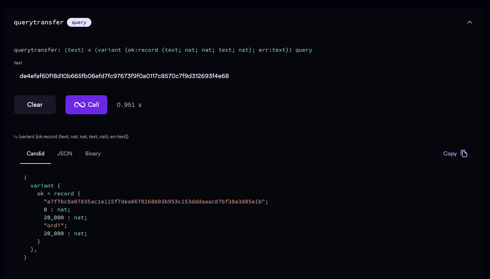

## 流程图
<!--  -->

candid-extractor target/wasm32-unknown-unknown/release/nomad_backend_backend.wasm > src/nomad_backend_backend/nomad_backend_backend.did

刻录一个 transfer
1. [user转钱到一个中间地址，value包括刻录的transfer包含的value以及下一笔交易的tx_fee，这笔交易是p_txid](https://mempool.space/testnet4/tx/de4efaf60f18d10b665fb06efd7fc97673f9f0a0117c8570c7f9d312693f4e68) 
2. [中间地址将inscription转给user，这是tx_id](a7f7bc9a07835ac1e115f7dea8670268b03b953c153dddaaac87bf38a3d85e1b)

query_transfer:
1. 入参必须是p_tx_id
2. 返回值是transfer inscription的(txid, vout, value, ticker, amount)

例如：
